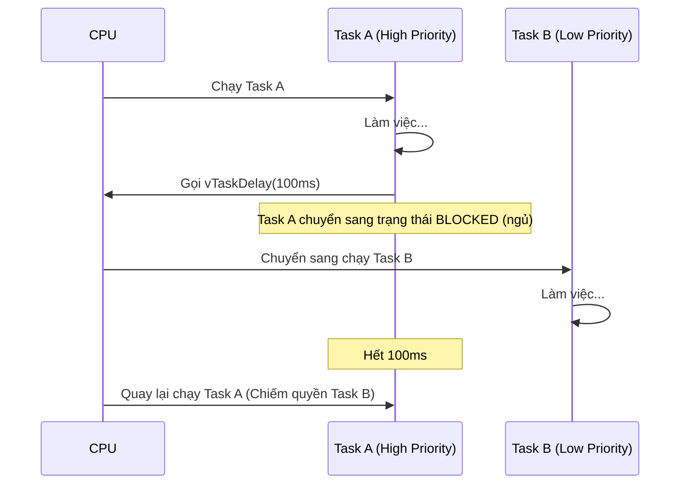

# Hướng dẫn FreeRTOS trên ESP32

ESP-IDF được xây dựng dựa trên FreeRTOS (phiên bản tùy chỉnh cho Dual Core). Dưới đây là những khái niệm cốt lõi bạn cần nắm vững:

## 0. Tại sao cần RTOS? (Hệ điều hành thời gian thực)

Trong lập trình vi điều khiển truyền thống (như Arduino), ta thường viết code trong vòng lặp vô tận `loop()` (gọi là Super Loop).
- **Vấn đề**: Nếu một tác vụ bị treo (ví dụ `delay(5000)`), toàn bộ hệ thống sẽ đứng im. Không thể vừa đọc cảm biến vừa nháy đèn LED mượt mà.
- **RTOS giải quyết**: Chia nhỏ chương trình thành nhiều **Task** độc lập. Hệ điều hành sẽ tự động chia thời gian CPU cho từng Task, tạo cảm giác chúng chạy song song.

## 1. app_main() là gì? (Quan trọng)

Trong ESP-IDF, `app_main()` **KHÔNG PHẢI** là hàm `main` bình thường của C.
- Nó thực chất là một **Task** được hệ thống tự động tạo ra khi khởi động.
- **Chức năng chính**: Khởi tạo hệ thống (Wifi, Database, Sensor, tạo các Task khác...).
- **Sau khi khởi tạo xong**: 
  - Bạn có thể để `app_main` kết thúc (return) -> Task này bị xóa, các task con do nó tạo ra vẫn chạy bình thường.
  - Hoặc dùng vòng lặp `while(1)` để biến nó thành một Task xử lý chính.

## 2. Task (Tác vụ)

Task là một chương trình con chạy độc lập (giống như một thread).
- **Hàm tạo**: `xTaskCreate()` hoặc `xTaskCreatePinnedToCore()` (chạy trên core cụ thể).
- **Delay**: Luôn dùng `vTaskDelay()` để nhường CPU cho task khác. Không dùng vòng lặp `while` trống (busy wait).
- **Priority**: Số càng cao ưu tiên càng lớn (khác với STM32).

## 3. Cơ chế Scheduler (Bộ lập lịch)

Bộ lập lịch quyết định Task nào được chạy.
- **Preemptive (Chiếm quyền)**: Nếu một Task có độ ưu tiên cao hơn xuất hiện (hoặc hết thời gian delay), Scheduler sẽ tạm dừng Task hiện tại để chạy Task kia.

## 4. Queue (Hàng đợi)

Dùng để giao tiếp giữa các task an toàn (gửi dữ liệu từ Task A sang Task B).
- **Tạo**: `xQueueCreate()`
- **Gửi**: `xQueueSend()`
- **Nhận**: `xQueueReceive()` (có thể chờ mãi mãi hoặc timeout)

## 3. Semaphore / Mutex (Đồng bộ hóa)
- **Mutex**: Dùng để bảo vệ tài nguyên chia sẻ (ví dụ: biến toàn cục, I2C bus, Serial log) để tránh 2 task truy cập cùng lúc gây lỗi.
- **Binary Semaphore**: Dùng để thông báo sự kiện (Task A làm xong -> báo Task B chạy).

## 6. Event Group

Dùng để chờ nhiều sự kiện xảy ra cùng lúc (ví dụ: chờ Wifi kết nối VÀ User đăng nhập xong).

---

# Cấu trúc Code mẫu (trong main.c)

Ví dụ dưới đây sẽ minh họa hệ thống gồm:
1. **Producer Task**: Giả lập đọc cảm biến và gửi vào Queue.
2. **Consumer Task**: Đọc từ Queue và xử lý.
3. **Heartbeat Task**: Nhấp nháy LED/Log để báo hệ thống đang chạy.
4. **Mutex**: Để bảo vệ việc in log ra màn hình không bị lộn xộn.

Xem chi tiết code trong file `main_freertos_demo.c` hoặc nội dung `main.c` tôi vừa cập nhật.
